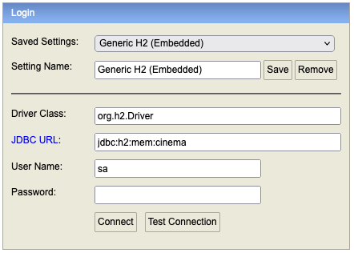
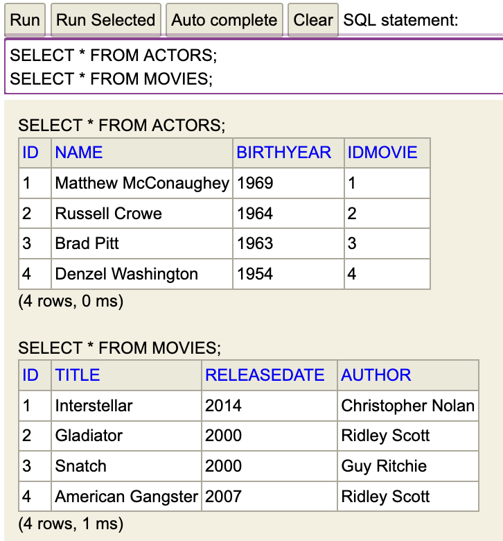

# Rapport Projet Cloud Integration | TADJER Badr & BOIRARD Cédric

## Introduction

This project is designed to transfer data from a source A (CSV file) to a source B (Database or JSON file).

## Execution
requirements:
- Java 17
- Java IDE
- Web Browser

This project can be run in two different ways.
- You can run the XML configuration ``json_channels.xml`` (csv -> json).
- You can run the XML configuration ``db_channels.xml`` (csv -> database).

### json_channel.xml
To execute the XML configuration ``json_channels.xml`` , you need to comment the lines below.
```java
@SpringBootApplication
//@ImportResource("classpath:db_channels.xml")
public class Main {
    public static void main(String[] args) {
        //SpringApplication.run(Main.class, args);
        new ClassPathXmlApplicationContext("json_channels.xml");
    }
}
```

### db_channel.xml
To execute the XML configuration ``db_channels.xml``, you need to comment the line below.
```java
@SpringBootApplication
@ImportResource("classpath:db_channels.xml")
public class Main {
    public static void main(String[] args) {
        SpringApplication.run(Main.class, args);
        //new ClassPathXmlApplicationContext("json_channels.xml");
    }
}
```

## Results obtained
### input files: CSV

``movies.csv``
```csv
IdMovie,Title,ReleaseDate,Author
1,Interstellar,2014,Christopher Nolan
2,Gladiator,2000,Ridley Scott
3,Snatch,2000,Guy Ritchie
4,American Gangster,2007,Ridley Scott
```

``actors.csv``
```csv
IdActor,Name,BirthYear,IdMovie
1,Matthew McConaughey,1969,1
2,Russell Crowe,1964,2
3,Brad Pitt,1963,3
4,Denzel Washington,1954,4
```

### output files : JSON | Database

#### JSON files results

``movies.json``
```json
[
  {"id":1,"title":"Interstellar","releaseDate":2014,"author":"Christopher Nolan"},
  {"id":2,"title":"Gladiator","releaseDate":2000,"author":"Ridley Scott"},
  {"id":3,"title":"Snatch","releaseDate":2000,"author":"Guy Ritchie"},
  {"id":4,"title":"American Gangster","releaseDate":2007,"author":"Ridley Scott"}
]
```

``actors.json``
```json
[
  {"id":1,"name":"Matthew McConaughey","birthYear":1969,"idMovie":1},
  {"id":2,"name":"Russell Crowe","birthYear":1964,"idMovie":2},
  {"id":3,"name":"Brad Pitt","birthYear":1963,"idMovie":3},
  {"id":4,"name":"Denzel Washington","birthYear":1954,"idMovie":4}
]
```

#### Database results
To see the result of the execution :

- launch browser to : ``localhost:9006/h2-console/``
- database name : ``cinema``
- user : ``sa``
- leave blank password



execute SQL requests :
```sql
SELECT * FROM MOVIES;
SELECT * FROM ACTORS;
```


